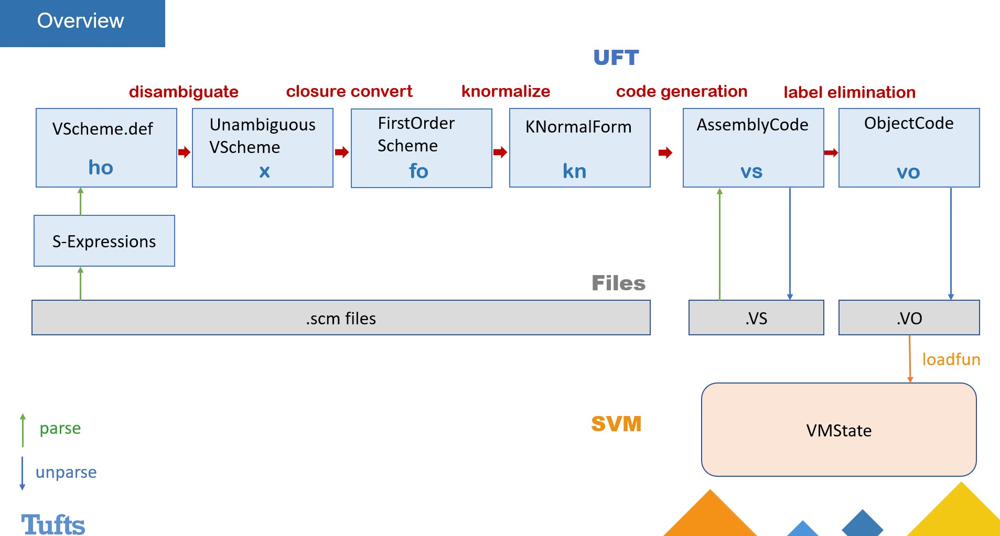

Simple Virtual Machines and Language Translation.

----------------------------------------------------------------------------------

In the repository, you'll find these directories:

  - `src` contains sources:

    - `src/svm` contains source code for the Simple Virtual Machine.
    - `src/uft` contains source code for the Universal Forward Translator.
    - `src/tests` contains tests for the SVM & UFT

  - `bin` contains compiled binaries

----------------------------------------------------------------------------------

Overview:
UFT & SVM structure overview

To see a whole presentation on the topic, please see the pdf in the directory
To run the uft:

    - uft <inlang>-<outlang> <file> 
    i.e. uft ho-vo sum.scm
    Type just uft into terminal for usage

To run the svm:

    - svm <file>

Together:

    - uft ho-vo sum.scm | svm
